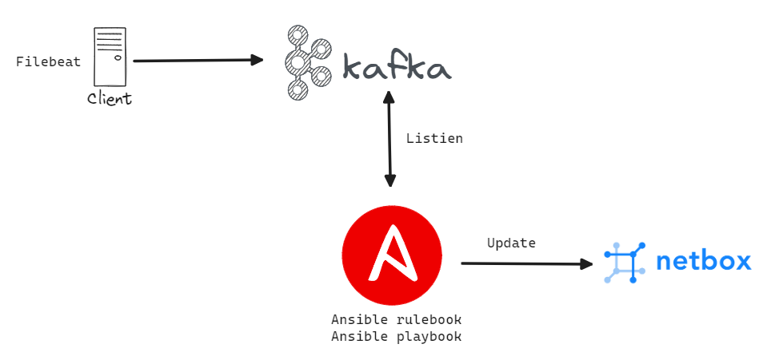

# Ghi chép về sử dụng eda ansible để nhận thông tin từ kafka

## Áp dụng cho usecase cập nhật tự động event của VM vào journal trên netbox.

### Mô hình 


### Mô tả:

- Các máy client sẽ cài đặt filebeat để gửi log của journald trong linux để đẩy về Kafka.  Trong ví dụ này sẽ lấy journald của dịch vụ Apache2
- EDA ansible sẽ listien topic trên kafka, sau đó trigger các event theo điều kiện.
- Khi điều kiện có nội dung `Stopped The Apache HTTP Server.` thì sẽ thực hiện playbook để gọi API tới netbox và thực hiện cập nhật journal cho VM có IP tương ứng.


### Cách dùng

- Bước 1: Đứng trên máy EDA Ansible thực hiện lệnh.
```
ansible-rulebook -i inventory.yml --rulebook http_rulebook.yml
```

- Bước 2:  Đứng trên client thực hiện start, stop apache2

- Bước 3: Quay lại màn hình ở bước 1 quan sát màn hình thực thi
- Bước 4: Truy cập máy cài netbox để xem journal của VM tương ứng.
 